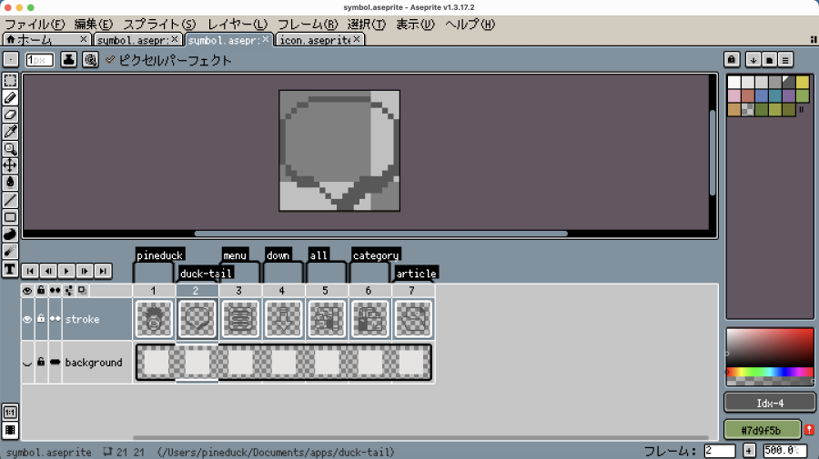
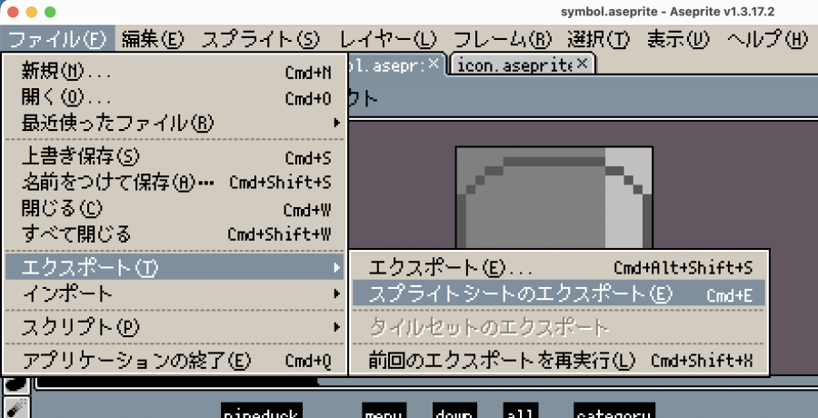
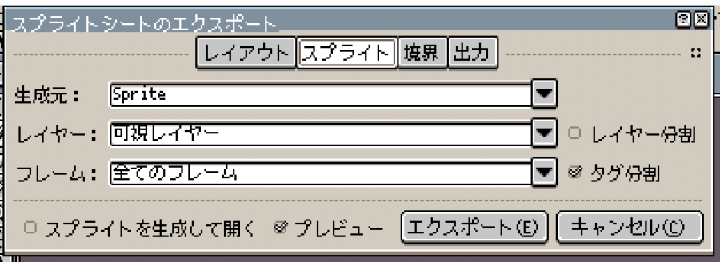
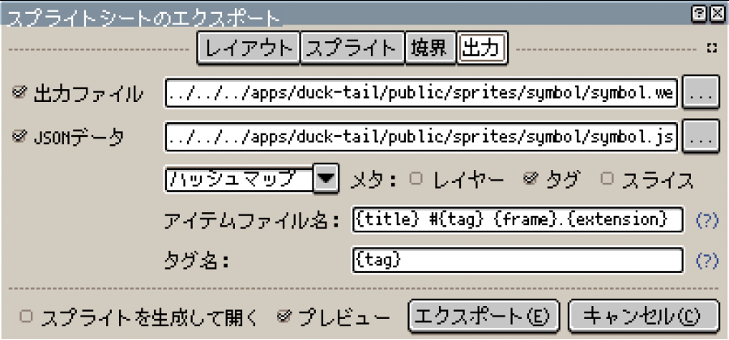

# スプライトの使用

Aseprite で作成したスプライトシートを CSS に変換して使用することができます。

このプロジェクトでは、シンボル画像（アニメーションのない画像）のみを使用します。

## 手順

### 1. Aseprite でスプライトシートを作成する

以下の項目を確認してください。

- 全てのフレームにタグが付いていること
- アニメーションはないこと



- **エクスポート > スプライトシートのエクスポート**を選択



- スプライト設定
  - 生成元: Sprite
  - タグ分割: ✔︎



- 出力設定
  - 出力ファイル: `/public/sprites/symbol/*.webp`
  - JSONデータ:
    - フォーマット: ハッシュマップ
    - タグ: ✔︎
    - 出力ファイル: `/public/sprites/symbol/*.json`
    - アイテムファイル名: `{title} #{tag} {frame}.{extension}`
    - タグ名: `{tag}`



## 2. CSS に変換する

以下のコマンドを実行すると、`src/styles/sprites-symbol.css` が生成されます。

```bash
npm run sprites
```

このコマンドは、`npm run dev`で開発サーバーを起動した際と、`npm run build` でビルドする際に自動的に実行されます。

## 3. スプライトシンボル を使用する

`data-sprite` 属性にシンボル名を指定することで、スプライトを使用できます。

```html
<span data-sprite="symbol-name"></span>
```

スプライトは CSS 変数を使用して、サイズをオーバーライドすることができます。

```css
.sprite-32px[data-sprite] {
  --sprite-w: 32px;
  --sprite-h: 32px;
}
```
